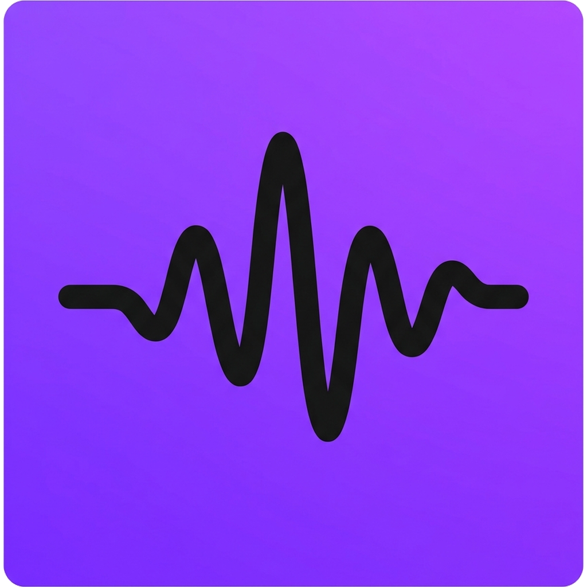

# 🎵 Pulse Music - Cross-Platform Native Music Streaming

<p align="center">
  
</p>

<p align="center">
  <strong>Ultra High-Fidelity Audio Streaming, Synchronized Lyrics, Real-time Visualizers, and Cross-Platform Native Apps.</strong>
</p>

<p align="center">
  <a href="#features">Features</a> •
  <a href="#architecture">Architecture</a> •
  <a href="#cross-platform-builds">Download & Platforms</a> •
  <a href="#quick-start">Quick Start</a> •
  <a href="#background-audio">Background Playback</a> •
  <a href="#license">License</a>
</p>

---

## ✨ Features

- **🎧 High-Fidelity Audio Streaming**: Instant zero-buffering music streaming with fallback master audio redundancy.
- **📱 Background & Screen-Off Playback**: Continuous playback when switching apps or locking mobile/desktop screens with full **MediaSession API** and hardware lock-screen controls.
- **🎤 Synchronized Karaoke Lyrics**: Real-time syllable & line synchronization with automatic audio progress tracking.
- **📊 Real-Time Canvas Audio Visualizer**: Dynamic multi-frequency audio visualizers with customizable visual modes (waveform, bars, circular).
- **🔒 Robust Authentication & Access Control**:
  - Email/Password login with strict validation & user-friendly error codes.
  - Google Sign-In via Google Identity Services (GIS).
  - Gated playlist creation & song liking (restricted to logged-in users with instant login prompts).
- **🖥️ Frameless Native Desktop Experience**: Electron shell with draggable custom titlebar, system tray controls, and global media key shortcuts.
- **📱 Mobile Native Optimization**: Responsive design adhering to 320px–480px mobile phones, 768px–1024px tablets, and 1440px+ 4K displays with $\ge 48\times 48\text{px}$ touch targets.
- **🛡️ Secure Code-Signed Releases**: Authenticode RSA-4096 signed installers served over HTTPS with published SHA-256 integrity checksums.

---

## 🏗️ Architecture & Tech Stack

```
pulse-music-app/
├── index.html                   # Master single-page native UI shell
├── manifest.json                # PWA Progressive Web App configuration
├── sw.js                        # Service Worker with offline caching
├── pulse-logo.png               # High-resolution transparent master logo
├── certs/                       # Authenticode RSA-4096 code-signing certificates
│   ├── pulse-authenticode.pfx
│   └── pulse-authenticode.cer
├── electron/                    # Desktop Application Shell
│   ├── main.cjs                 # Electron main process (tray, shortcuts, frameless)
│   └── preload.cjs              # IPC context bridge
├── src/                         # Frontend Application Core
│   ├── main.js                  # Player engine, MediaSession, auth gates, UI handlers
│   ├── style.css                # Design system tokens & multi-breakpoint responsive CSS
│   ├── musicService.js          # Catalog manager, Supabase, search & discovery
│   ├── visualizer.js           # HTML5 Canvas audio spectrum visualizer
│   └── supabaseClient.js        # Supabase database & storage client
├── scripts/                     # Automation & Build Tooling
│   ├── build_release_packages.py# Standalone multi-platform bundler & checksum generator
│   ├── generate_all_app_icons.py# Multi-resolution ICO, Android mipmap & iOS AppIcon generator
│   ├── generate_certificates.py # Code signing certificate generator
│   └── test_*.py                # Automated test suites
├── server.py                    # Production Python HTTP/HTTPS streaming backend
└── storage/downloads/           # Code-signed standalone binary distribution packages
```

---

## 🚀 Quick Start

### 1. Prerequisites
- **Python 3.10+** (or modern Node.js)

### 2. Launch Local Development Server
```bash
# Start backend streaming server and API daemon
python server.py
```
Open [http://localhost:3000](http://localhost:3000) in your browser.

### 3. Launch Desktop Native Mode (Electron)
```bash
npx electron .
```

---

## 📱 Background & Screen-Off Audio Playback

Pulse Music implements an advanced background audio subsystem:
- **MediaSession API Integration**: Real-time track metadata (title, artist, album, multi-size artwork) with lock screen controls (Play, Pause, Next, Previous, Seek $\pm 5\text{s}$).
- **Web Audio Keepalive Pipeline**: Continuous silent audio clock buffer that prevents Android, iOS Safari, and Chromium from suspending audio when the device screen is dark or locked.
- **Power Save Blocker**: Prevents OS suspension on Windows, macOS, and Linux during active audio sessions.

---

## 📦 Standalone Native Packages

Pulse Music packages standalone binaries for all major platforms:

| Platform | Package Format | Architecture | Download Endpoint |
| :--- | :--- | :--- | :--- |
| **Windows** | `.exe` (NSIS Installer) | x64 / ARM64 | `/api/download/windows` |
| **macOS** | `.dmg` (Universal Disk Image) | Apple Silicon & Intel | `/api/download/mac` |
| **Linux** | `.AppImage` (Standalone) | x86_64 | `/api/download/linux` |
| **Android** | `.apk` (Signed Release) | ARM64, ARMv7, x86_64 | `/api/download/android` |
| **iOS** | `.ipa` (Distribution Bundle) | iPhone & iPad | `/api/download/ios` |

---

## 🧪 Verification & Automated Testing

Run the full verification suite:
```bash
# Run comprehensive production verification (40 checks)
python scripts/verify_app_productionization.py

# Run API and Auth test suites
python scripts/test_download_api.py
python scripts/test_auth_api.py
```

---

## 👨‍💻 Author & License

Designed & Developed by **Pushkar Hiremath**.
Licensed under the [MIT License](LICENSE).
